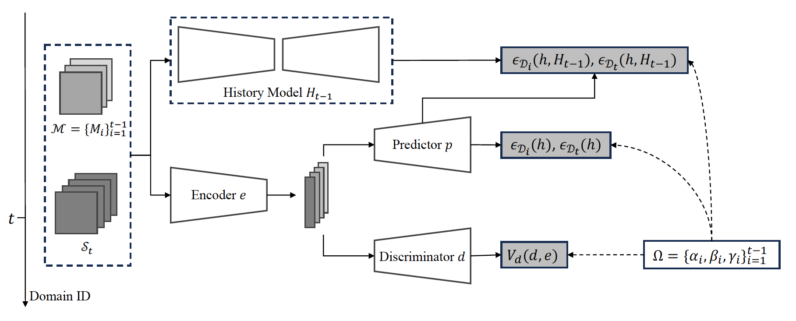
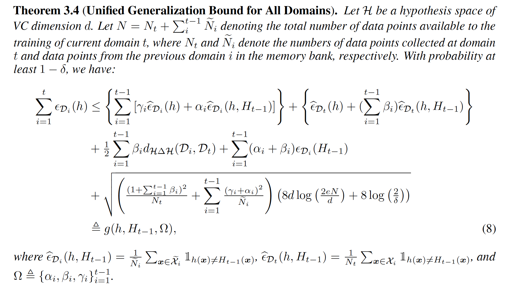
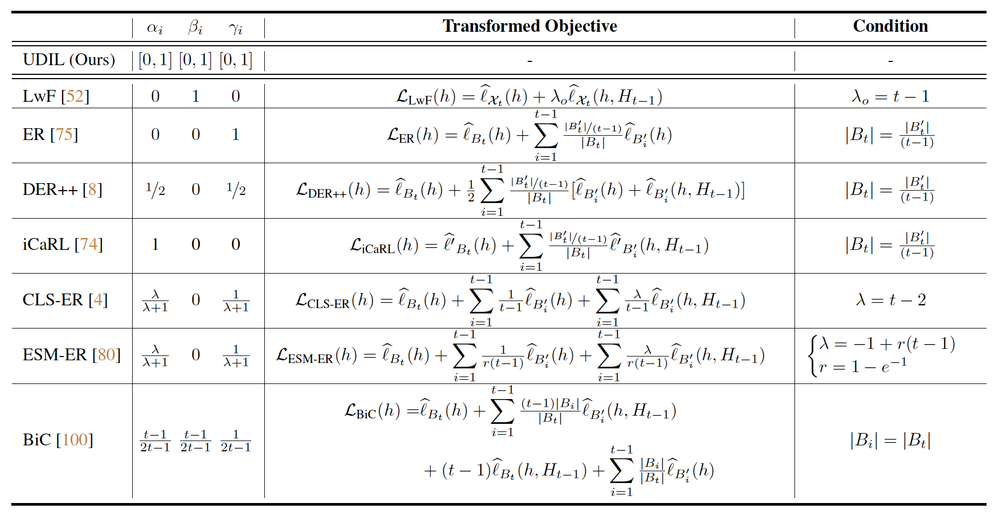
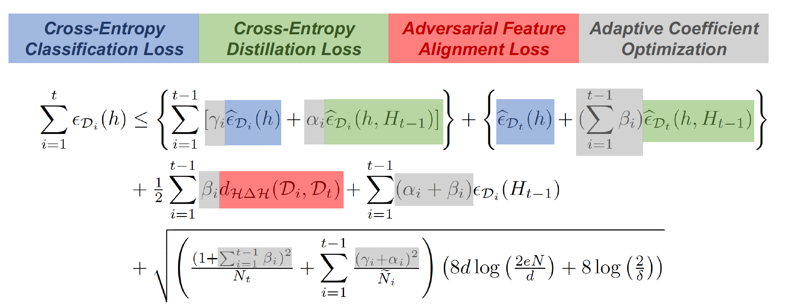
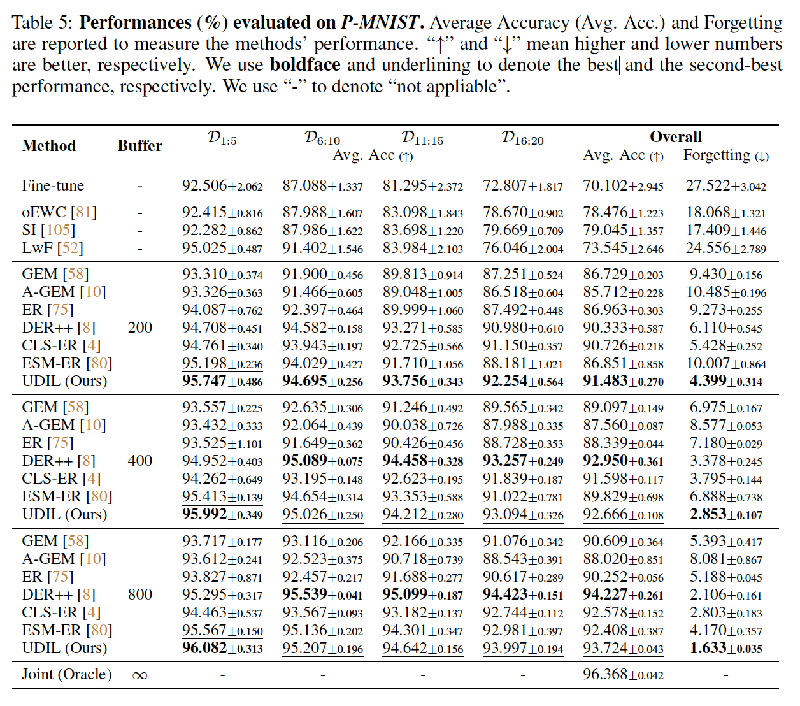
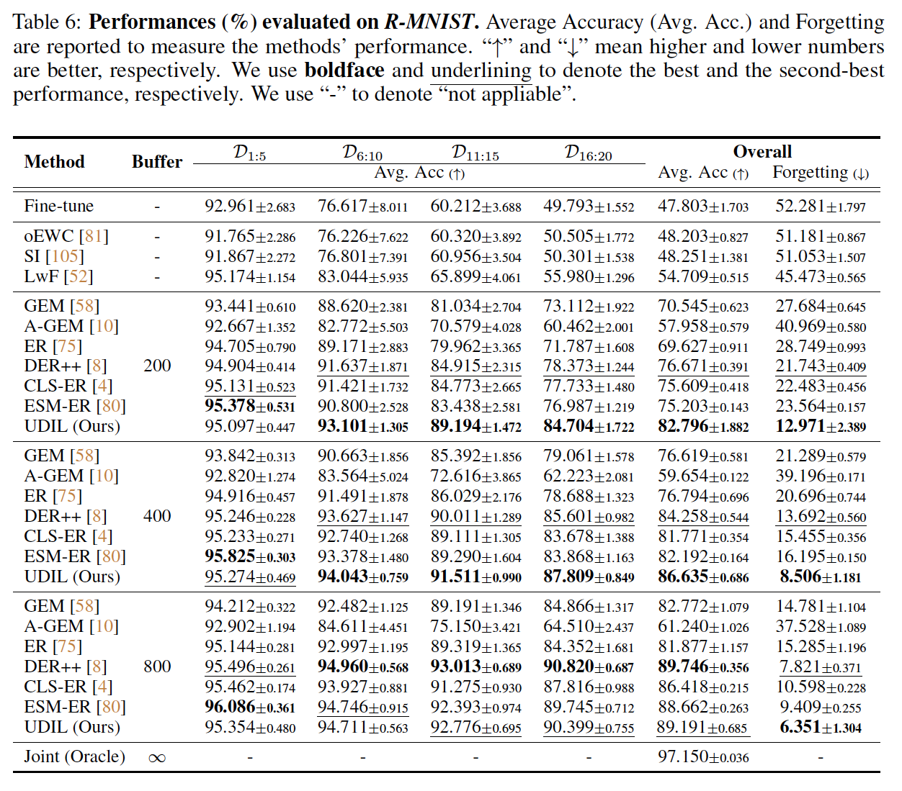
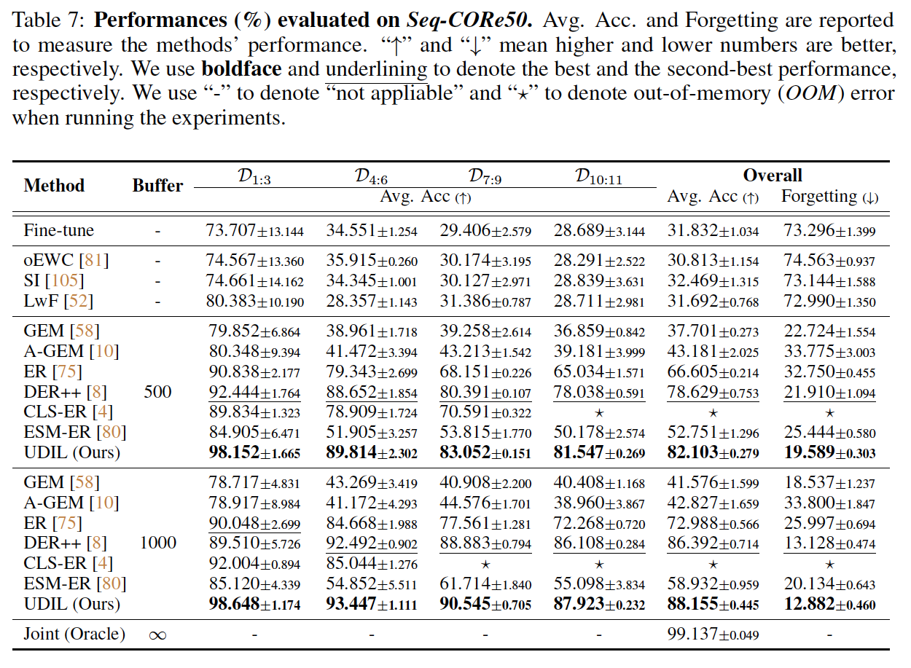
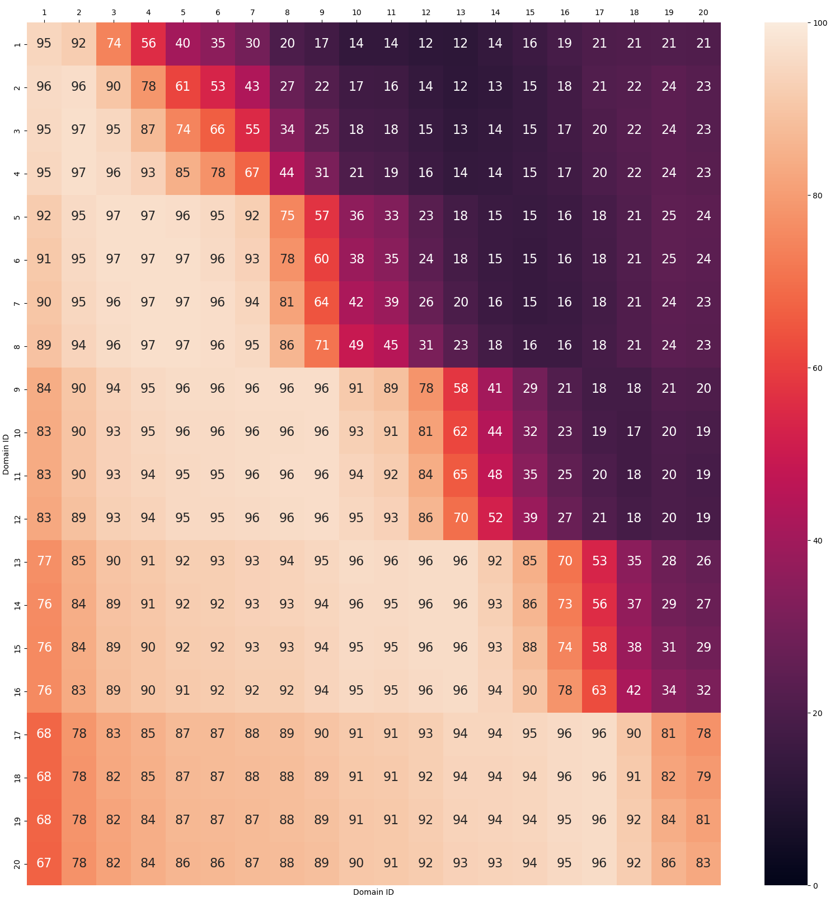
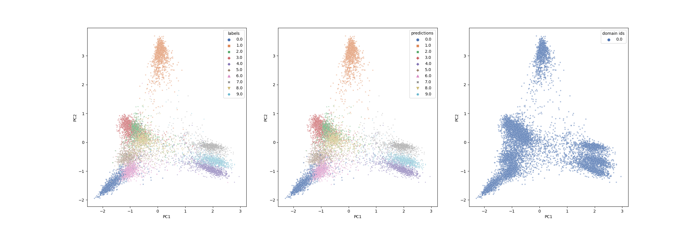
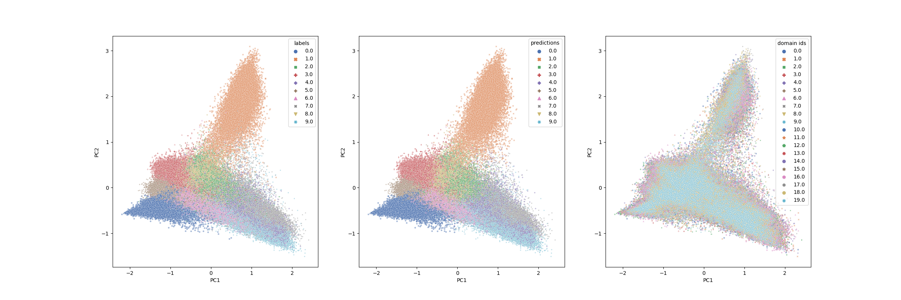

# A Unified Approach to Domain Incremental Learning with Memory: Theory and Algorithm (UDIL)
This repo (built upon the amazing [codebase of mammoth](https://github.com/aimagelab/mammoth)) contains the code for our NeurIPS 2023 paper:<br>
**A Unified Approach to Domain Incremental Learning with Memory: Theory and Algorithm**<br>
Haizhou Shi, Hao Wang<br>
*Thirty-seventh Conference on Neural Information Processing Systems, 2023*<br>
[[Paper](https://arxiv.org/abs/2310.12244)] [[OpenReview](https://openreview.net/forum?id=FiClXlUqA7&noteId=FiClXlUqA7)] [[Slides](https://drive.google.com/file/d/1hGTzu6pXAandJWZMBv0VPP5ojNJCtnbo/view?usp=sharing)] [[Talk (Youtube)](https://www.youtube.com/watch?v=E4IEKoEw8OI)] [[Talk (Bilibili)](https://www.bilibili.com/video/BV1Wu4y1j7c5/?vd_source=b969f97327caaabb580ee560c3178a23)]
<p align="center">

</p>


## Outline
* [How does UDIL unify existing methods?](#how-does-udil-unify-existing-methods)
* [How does UDIL lead to a tighter bound?](#how-does-udil-lead-to-a-tighter-bound)
* [Installing the required packages](#installing-the-required-packages)
* [Code for running UDIL](#code-for-running-udil)
* [Quantitative Results](#quantitative-results)
* [Related Work](#also-check-our-relevant-work-on-domain-adaptation)
* [References](#references)

## How does UDIL Unify Existing Methods?
Long story short, in the paper, we start by re-iterating the learning objective of domain-incremental learning (which is also true for other types of continual learning). Then we propose to combine three ways of upper bounding the past-domain error (ERM, intra-domain bound, and cross-domain bound, see Chapter 3 in the paper) and assign adaptive coefficients to each of the upper bound training terms. 

Here is the main theorem of our paper, which not only leads to the unification of the current domain-incremental learning methods, but allows for the possibility of minimizing a tighter bound in the next chapter.
<p align="center">

</p>

The first main argument of our work is that, by fixating the value of the coefficients $\Omega=\{\alpha_i, \beta_i, \gamma_i\}$, the UDIL framework can exactly correspond to some of the exisiting methods, when some conditions need to be satisfied. Here we show the final unification result derived for you (refer to Appendix B in the paper).
<p align="center">

</p>

## How does UDIL Lead to a Tighter Bound?
A natural question following the unification is: *can we do better than using a single set of fixed coefficients to train a domain-incremental learning model?* The answer is a firmly YES. 
And what we do in this work is to parameterize the coefficients, and try to optimize a tighter bound by adjusting them during model training. We know you are in a hurry, so here we will give an extremely brief review of what we do to form the final training objective. 
<p align="center">

</p>
As you can see, there are in total four kinds of differentiable loss terms in our proposed algorithm: 

- 🔵 **Cross-Entropy Classification Loss:** it corresponds to the simple <span style="color:blue">ERM terms</span> on the current data and the memory.
- 🟢 **Cross-Entropy Distillation Loss:** it corresponds to the <span style="color:green">distillation loss terms</span>  between the current model $h$ and the history model $H_{t-1}$, computed on the current data and the memory.
- 🔴 **Adversarial Feature Alignment Loss:** it corresponds to the <span style="color:red">divergence terms</span> between the current data distribution and the past data distribution. If you are interested in how minimizing this term on the feature space can improve the performance in general, please refer to the amazing work ["A theory of learning from different domains"](https://link.springer.com/article/10.1007/s10994-009-5152-4).
- ⚪ **Adaptive Coefficient Optimization:** it corresponds to estimating the error (classification accuracy) of each term, and adaptively minimizing the <span style="color:gray">coefficient set</span> $\Omega=\{\alpha_i, \beta_i, \gamma_i\}$. 

## Installing the Required Packages
```sh
conda create -n udil python=3.9
conda activate udil
conda install pytorch==1.12 torchvision cudatoolkit=11.3 -c pytorch
conda install wandb ipdb -c conda-forge
```

## Code for Running UDIL
Before you run the code, there are a couple of settings you might want to modify: 
- `wandb_entity`: at `utils/args.py` line 70, change to your own wandb account;
- `data_path` and `base_path`: at `utils/conf` line 13-23, change to whatever path you want to store your data and local training logs.

We have provided the command to run UDIL in the `/scripts` folders, for different datasets. 
Once you are done with setting up everything, a quick example of running UDIL on `Permutated-MNIST` is shown as follows:
```sh
chmod +x scripts/*.sh
scripts/pmnist.sh
```
This script will start a UDIL training process and log everything on your wandb repository.

*If you are in a hurry, and want to just take a quick review on the training process and final results of UDIL on three different realistic datasets (Permutated-MNIST, Rotated-MNIST, and Seq-CORe50), you can check out the following public [UDIL wandb project](https://wandb.ai/haizhou-shi/UDIL), where we viusalized everything you might care for you!*

## Quantitative Results
Here we provide some quantitative results of UDIL.
<p align="center">

</p>

<p align="center">

</p>

<p align="center">

</p>

## Qualitative Results
Here we provide some qualitative results of UDIL, which come from the public [UDIL wandb project](https://wandb.ai/haizhou-shi/UDIL), and we only show the results on Rotated-MNIST data. 
<p align="center">
<span>Accuracy Matrix after 20-Domain Training</span>

</p>

Below are the visualization of embedding distributions of different classes \& domains, where:
- **Left**: colors represent different *true* classes; 
- **Middle**: colors represent different *predicted* classes by the model; 
- **Right**: colors represent different domains.
<p align="center">
<span>Embedding Space Visualization after 1-Domain Training</span>

</p>

<p align="center">
<span>Embedding Space Visualization after 20-Domain Training</span>

</p>

## Also Check Our Relevant Work on Domain Adaptation
<span id="paper_1">[1] **Domain-Indexing Variational Bayes: Interpretable Domain Index for Domain Adaptation**<br></span>
Zihao Xu*, Guang-Yuan Hao*, Hao He, Hao Wang<br>
*Eleventh International Conference on Learning Representations, 2023*<br>
[[Paper](https://arxiv.org/abs/2302.02561)] [[OpenReview](https://openreview.net/forum?id=pxStyaf2oJ5&referrer=%5Bthe%20profile%20of%20Zihao%20Xu%5D(%2Fprofile%3Fid%3D~Zihao_Xu2))] [[PPT](https://shsjxzh.github.io/files/VDI_10_miniutes_2nd_version_to_pdf.pdf)] [[Talk (Youtube)](https://www.youtube.com/watch?v=xARD4VG19ec)] [[Talk (Bilibili)](https://www.bilibili.com/video/BV13N411w734/?vd_source=38c48d8008e903abbc6aa45a5cc63d8f)]

<span id="paper_2">[2] **Graph-Relational Domain Adaptation**<br></span>
Zihao Xu, Hao He, Guang-He Lee, Yuyang Wang, Hao Wang<br>
*Tenth International Conference on Learning Representations (ICLR), 2022*<br>
[[Paper](http://wanghao.in/paper/ICLR22_GRDA.pdf)] [[Code](https://github.com/Wang-ML-Lab/GRDA)] [[Talk](https://www.youtube.com/watch?v=oNM5hZGVv34)] [[Slides](http://wanghao.in/slides/GRDA_slides.pptx)]

<span id="paper_3">[3] **Continuously Indexed Domain Adaptation**<br></span>
Hao Wang*, Hao He*, Dina Katabi<br>
*Thirty-Seventh International Conference on Machine Learning (ICML), 2020*<br>
[[Paper](http://wanghao.in/paper/ICML20_CIDA.pdf)] [[Code](https://github.com/hehaodele/CIDA)] [[Talk](https://www.youtube.com/watch?v=KtZPSCD-WhQ)] [[Blog](http://wanghao.in/CIDA-Blog/CIDA.html)] [[Slides](http://wanghao.in/slides/CIDA_slides.pptx)] [[Website](http://cida.csail.mit.edu/)]


## References
[A Unified Approach to Domain Incremental Learning with Memory: Theory and Algorithm](https://arxiv.org/abs/2310.12244)
```bib
@inproceedings{shi2023unified,
author = {Shi, Haizhou and Wang, Hao},
title = {A unified approach to domain incremental learning with memory: theory and algorithm},
year = {2023},
publisher = {Curran Associates Inc.},
address = {Red Hook, NY, USA},
abstract = {Domain incremental learning aims to adapt to a sequence of domains with access to only a small subset of data (i.e., memory) from previous domains. Various methods have been proposed for this problem, but it is still unclear how they are related and when practitioners should choose one method over another. In response, we propose a unified framework, dubbed Unified Domain Incremental Learning (UDIL), for domain incremental learning with memory. Our UDIL unifies various existing methods, and our theoretical analysis shows that UDIL always achieves a tighter generalization error bound compared to these methods. The key insight is that different existing methods correspond to our bound with different fixed coefficients; based on insights from this unification, our UDIL allows adaptive coefficients during training, thereby always achieving the tightest bound. Empirical results show that our UDIL outperforms the state-of-the-art domain incremental learning methods on both synthetic and real-world datasets. Code will be available at https://github.com/Wang-ML-Lab/unified-continual-learning.},
booktitle = {Proceedings of the 37th International Conference on Neural Information Processing Systems},
articleno = {660},
numpages = {33},
location = {New Orleans, LA, USA},
series = {NIPS '23}
}
```
